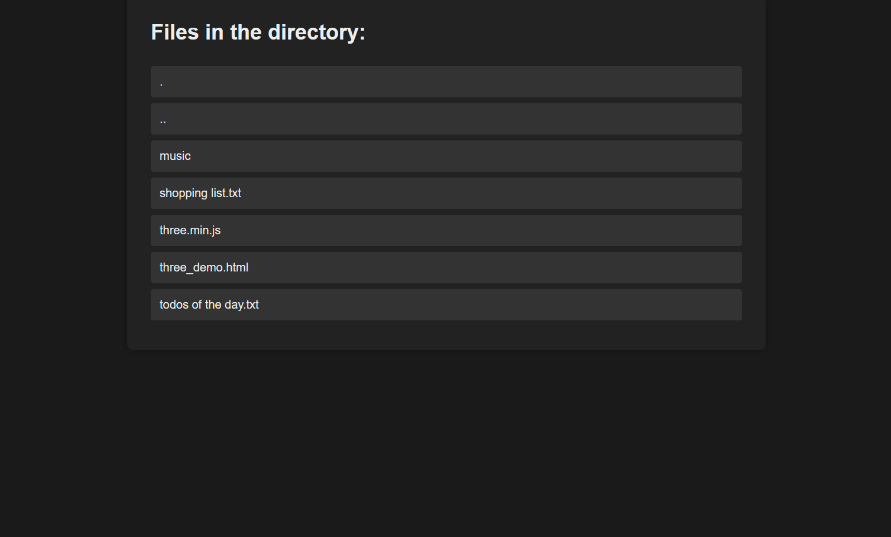

# file-server

A lightweight HTTP file server written in C, leveraging the power of `libevent`.



## Table of Contents

- [Technical Details](#technical-details)
- [Dependencies](#dependencies)
- [How to Compile](#how-to-compile)
- [Usage](#usage)

## Technical Details

This project consists of a standalone HTTP file server that can serve files over a network. It is built using C and libevent.

## Dependencies

- libevent 

## How to Compile

To compile the project, follow these steps:

```bash
cmake -B ./build
cd build
make
```

## Usage

To run the server, navigate to the directory containing the compiled `file_server` binary and execute the following command:

```bash
./file_server [port] [path]
